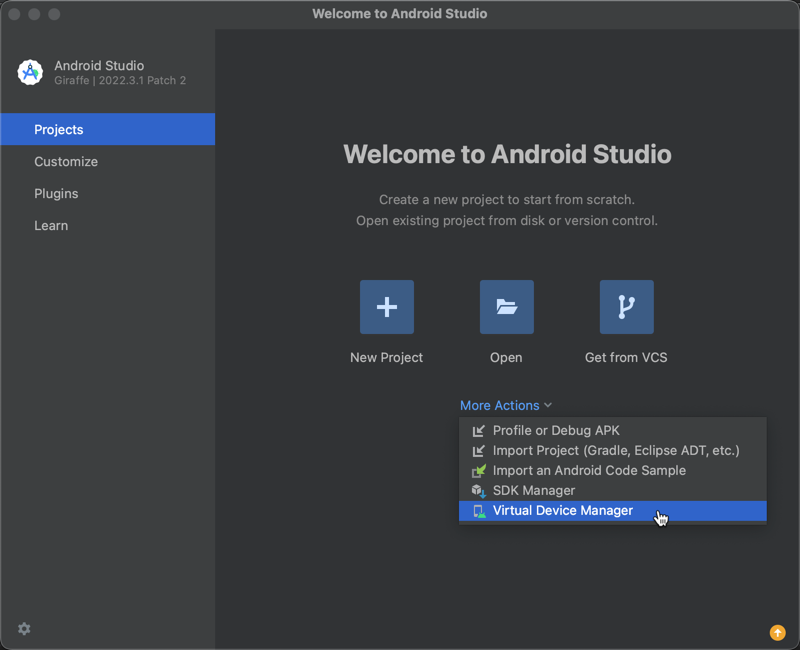
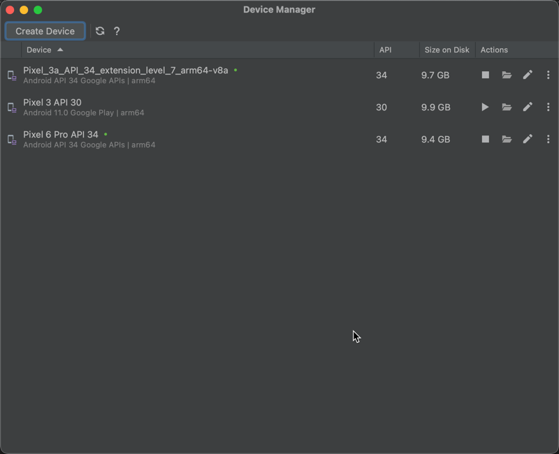
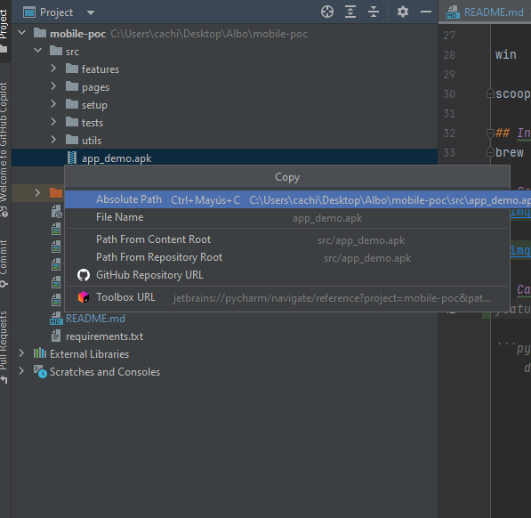
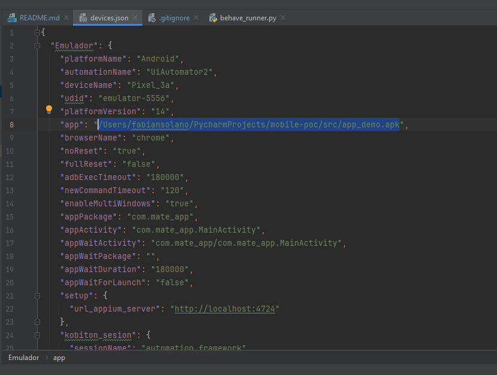
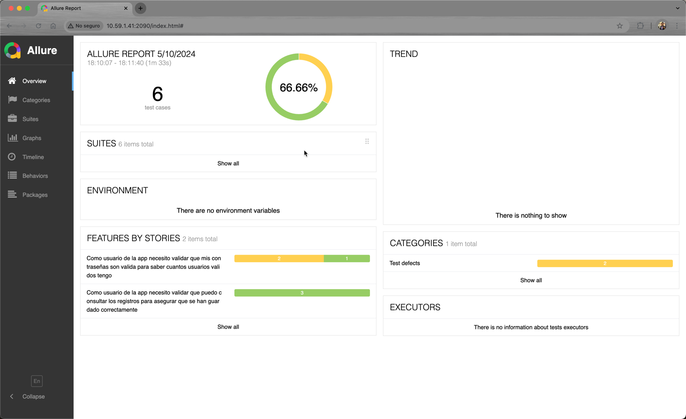
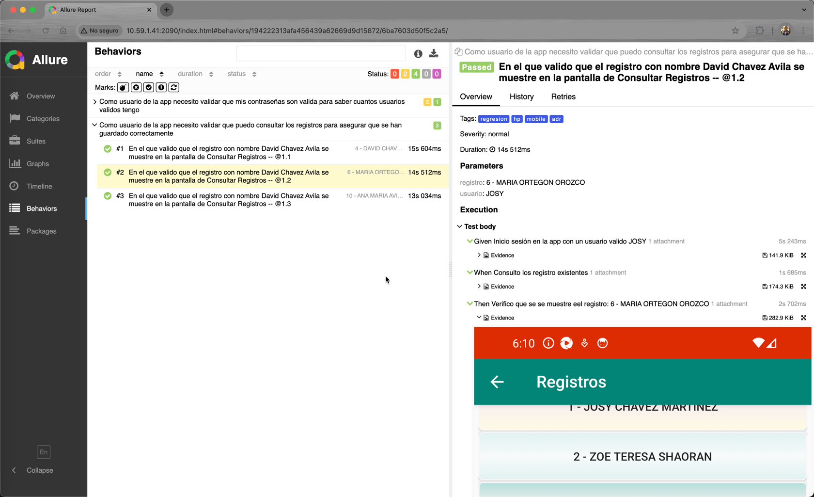
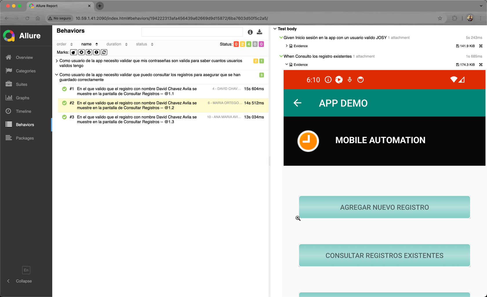

# qa-mobile-poc

## Comenzando
## instale un entorno virtual en la carpeta raiz
cd /path/to/proyect/

python -m venv venv

## Active el ambiente que acaba de generar
mac

source venv/bin/activate

win power shell

.\venv\Scripts\activate.ps1

## Instale las dependencias en el archvo requirements.txt ubicado en la raiz
pip -r requirements.txt

## Instale Allure
Mac

brew install allure

win

scoop install allure

## Instale android studio
brew install --cask android-studio

## Genere un dispositivo emulado con android studio - virtual device manager

## Cambie la ruta del apk apuntando hacia la nuevo path dentro del archivo setup/devices

## Ejeute el archivo behave_runner.py
python src/behave_runner.py

## Si no logra ejecutar o ver el reporte de allure puede ejecutar desde linea de comando
cd src

behave -f allure_behave.formatter:AllureFormatter -o allure-results -f pretty features/

##Cuando termine la ejecucion ejecute los 2 siguientes comandos

allure generate ./allure-results --output ./allure-report --clean

allure open --port 4000

puede ocupar cualquier puerto que desee

## Se abrira el reporte de allure con los resultados

## Para terminar los procesos solo cierre la terminal o ctrl + c